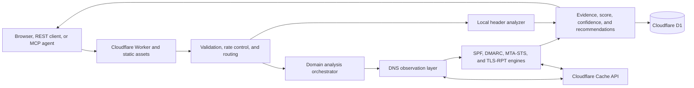

# Email Security Analyzer architecture

## Interface decisions, 2026-09-05

The public name is Email Security. Task headings follow the selected tool.
Domain reports lead with freshness, results, and next steps, before sharing
and exports. Inconclusive observations stay visible. DMARC guidance requires
sender review and monitoring before stronger enforcement.

Last reviewed: 2026-08-23

Email Security Analyzer is an evidence-first diagnostic service for public email-domain posture and pasted message headers. It combines standards-aware DNS analysis, bounded policy retrieval, local header interpretation, shareable reports, REST APIs, and MCP tools in one Cloudflare Worker.

The infographic is a conceptual overview. The tables and flows below describe the implemented system.

## What the product does

The service supports four related workflows:

- Domain posture analysis covering SPF, DKIM discovery, DMARC, MX, CAA, PTR observations, MTA-STS, and TLS-RPT
- SPF inspection, sender evaluation, recursion accounting, and guarded flattening previews
- SPF and DMARC record validation plus review-ready record construction
- Stateless interpretation of pasted message headers with optional public-IP hop enrichment

It also compares up to 3 domains, stores optional shareable reports, exports JSON, and exposes its complete read-only capability through REST and nine MCP tools.

## System context

## Runtime components

| Component | Responsibility | Primary source |
| --- | --- | --- |
| Worker router | Serves the site, validates requests, applies security headers and rate controls, dispatches APIs and MCP, retrieves reports, and runs retention cleanup | `worker.js` |
| Domain analyzer | Coordinates DNS, SPF, DKIM, DMARC, MX, CAA, PTR, MTA-STS, TLS-RPT, scoring, confidence, and budget evidence | `worker.js` |
| DMARC reporting policy | Compares reporting and policy organisational domains, builds RFC 9990 authorisation names, and keeps positive, negative, and transient DNS results distinct | `dmarc-reporting.js` |
| Header analyzer | Parses Received, Authentication-Results, Received-SPF, DKIM-Signature, alignment, conflicts, and delivery hops without network access | `header-analyzer.js` |
| MCP adapter | Maps nine typed MCP tools to the same core functions used by REST | `mcp.js` |
| Redirect policy | Constrains MTA-STS retrieval and final origin handling | `redirects.js` |
| Retention module | Defines expiry and cleanup behavior for bearer-link reports | `retention.js` |
| Browser application | Provides domain, batch, SPF, record-building, and header-analysis workflows | `web/app.js`, `web/index.html` |
| Persistence | Stores domain and batch reports with expiry metadata | `schema.sql`, D1 binding `DB` |

The core is currently a single Worker module. The internal separation is logical rather than a set of independently deployed services.

## Domain-analysis flow

1. The caller submits a normalized public domain.
2. The router validates method, content type, request size, origin, domain syntax, and batch bounds.
3. A request-wide budget reserves at most 45 outbound subrequests and enforces a 20-second wall-clock ceiling; work past the deadline degrades to timeout states instead of stretching the request.
4. DNS queries run through structured DNS over HTTPS. NODATA, NXDOMAIN, timeout, SERVFAIL, provider error, and budget exhaustion remain distinct states.
5. SPF records are parsed case-insensitively. Includes and redirects are traversed within lookup, void, cycle, depth, and request budgets. A record whose terminal strength lives behind `redirect=` is judged by the redirect target's all-term; unresolvable targets fail closed, and sender-macro targets are disclosed as statically unverifiable instead of being queried literally.
6. DMARC discovery follows the RFC 9989 tree walk. For records found at an ancestor domain, the effective policy applied to the checked domain is `sp=` when present, not the parent's `p=`.
7. DKIM checks probe the whole bounded selector catalogue, selectors inferred from SPF and MX first. Absence outside that catalogue is reported as limited coverage.
8. MX, Null MX, implicit MX fallback, CAA, TLS-RPT, and MTA-STS evidence is collected. Within the shared request budget, scored controls are scheduled first. SPF recursion runs before the MTA-STS policy fetch and DKIM discovery. External DMARC reporting authorisation and the inbound PTR observation then use the remaining budget. PTR is capped at four observations.
9. MTA-STS is fetched only from the expected HTTPS origin with redirects rejected, bounded body reads, and an explicit timeout.
10. Findings feed a deterministic score. Unknown observations reduce confidence rather than receiving definitive failure points.
11. The response includes raw evidence, checks, recommendations, score confidence, unknown controls, source revision, and request-budget use.
12. Sharing is opt-in. The report is stored in D1 under an opaque 14-day bearer identifier only when the caller sets `share: true` (REST, MCP, or the UI checkbox). Cache hits do not insert a row unless sharing was requested. Possession of the id is the revoke credential (`DELETE /api/reports/{id}`).

## Header-analysis flow

1. The caller pastes message headers, capped at 256 KiB.
2. `header-analyzer.js` parses fields locally without DNS or HTTP calls.
3. Authentication-Results and related fields are presented as receiver-provided evidence. They are not cryptographically re-verified.
4. The analyzer builds structured hops, detects conflicting results, and evaluates visible SPF, DKIM, and DMARC alignment claims.
5. If the caller separately requests enrichment, up to ten globally routable hop addresses receive bounded PTR and forward-confirmation observations. Only authoritative PTR outcomes are edge-cached; transient resolver failures return an explicit inconclusive state and retry on the next request.

## Interfaces

| Interface | Capability |
| --- | --- |
| `POST /api/v2/domain-check` | Complete domain posture analysis |
| `POST /api/v2/header-analysis` | Stateless header interpretation |
| `POST /api/batch` | Compare up to 3 domains with per-domain budget slices |
| `POST /api/spf/inspect` | Recursive SPF inspection and flattening proof |
| `POST /api/spf/evaluate` | SPF evaluation for client IP, sender, and HELO |
| `POST /api/records/validate` | Validate proposed SPF or DMARC |
| `POST /api/v2/record-build` | Construct a review-ready record |
| `POST /api/header/enrich` | Enrich bounded delivery-hop IP addresses |
| `GET /api/reports/{reportId}` | Retrieve an unexpired report |
| `GET /api/reports/{reportId}/export` | Download an unexpired report as JSON |
| `DELETE /api/reports/{reportId}` | Revoke a stored bearer report |
| `POST /mcp` and `POST /mcp/v2` | Stateless Streamable HTTP MCP |

MCP publishes `analyze_email_domain`, `analyze_email_headers`, `analyze_email_domains_batch`, `inspect_spf`, `evaluate_spf`, `validate_email_record`, `build_email_record`, `enrich_email_hops`, and `get_email_security_report`.

## Third-party services and libraries

| Service or library | Use | Data sent | Required |
| --- | --- | --- | --- |
| Cloudflare Workers and Assets | Runtime, custom domains, static site, request handling, and Cron | Normal service request metadata | Yes |
| Cloudflare D1 | Shareable report storage (opt-in) and durable quota state | Report JSON, expiry metadata, opaque IDs, one-way client fingerprints | Required for sharing and daily caps |
| Cloudflare Rate Limiting bindings | Edge abuse controls for standard, expensive, and MCP routes | Cloudflare-managed request keys and counters | Production control |
| Cloudflare Cache API | Caches repeated domain analyses (analysis only — never a requester's share id or expiry), including inconclusive/zero-score rows for a slightly shorter window so SERVFAIL/timeout does not stampede the DoH ladder, plus PTR observations, durable MTA-STS observations, and authoritative PTR enrichment answers (fetched policies/answers or definitive DNS outcomes; transient failures stay uncached) | Internal cache keys and processed responses | Performance optimization |
| Cloudflare DNS over HTTPS | Primary DNS observations | Domain or address and record type | Yes |
| Google Public DNS | Transient-error fallback and provider evidence | Domain or address and record type | Fallback |
| Quad9 DNS over HTTPS | Additional transient-error fallback | Domain or address and record type | Fallback |
| Analysed domain DNS | Published email records | Standard DNS queries via the named resolvers | Core subject |
| `mta-sts.<domain>` | Published MTA-STS policy retrieval | HTTPS request for `/.well-known/mta-sts.txt` | Conditional |
| `mailauth` | Local RFC 7208 SPF evaluation | No external service call | Local dependency |
| `tldts` | Local public-suffix and organisational-domain handling | No external service call | Local dependency |

The application has no mailbox connection, DMARC aggregate-report ingestion, sender reputation feed, or automatic DNS-write integration.

## Storage, privacy, and retention

Domain analyses and durable MTA-STS observations are cached for five minutes (inconclusive/zero-score domain analyses use a slightly shorter Cache API window). Domain reports expose the observation time, cache-hit state, and earliest refresh time. DNS requests do not add an extra Worker HTTP cache over the resolver's own TTL. The browser enables Refresh DNS when the analysis cache window ends; normal request limits still apply.

The result leads with unresolved controls. SPF previews remain available, but healthy records below eight lookups explicitly say that flattening is unnecessary for lookup pressure.

- Domain and batch reports are stored in D1 only when the caller explicitly requests sharing (`share: true` or the UI checkbox). Otherwise no report row is inserted, including on analysis-cache hits.
- Stored reports use 128-bit opaque bearer identifiers (legacy 16-character ids remain retrievable until they expire). They expire after 14 days and are removed by an hourly Cron Trigger. `DELETE /api/reports/{id}` revokes an unexpired row immediately.
- Report retrieval, export, and revoke use `Cache-Control: private, no-store` and share the standard per-minute limiter plus the report daily quota.
- Header analysis is stateless and is not saved as a shareable report. Pasted headers are interpreted in memory for the request only.
- The system stores analysis evidence and recommendations only for opted-in shares. It does not need mailbox credentials or domain DNS credentials.
- Clients should avoid placing sensitive content in pasted headers because the headers are processed by the service even when they are not retained.
- REST analysis POSTs require `Content-Type: application/json` (415 otherwise) so simple CORS `text/plain` requests cannot burn colo quota without preflight. MCP already requires JSON.
- Daily analysis POST accounting fails closed: a D1 outage answers 503 rather than running without the durable cap (the same choice report GET already made).
- MCP stays open for testing with stricter abuse controls than REST: 6 requests per client per minute, 80 analysis tool calls per UTC day, and 40 report retrievals per UTC day. `get_email_security_report` consumes the MCP report quota, not the analysis quota. All nine tools remain published.
- Public domain validation requires a registrable DNS name and refuses special-use suffixes such as `.local`, `.localhost`, `.internal`, and `.lan`.
- SPF evaluation accepts private and documentation-range client IPs for lab fixtures; hop enrichment still requires public addresses.

## Security and correctness boundaries

- Request bodies are bounded before JSON parsing.
- Only public domains and public enrichment IPs are accepted. SPF evaluation may use private or documentation-range client IPs as lab input; that path does not probe the address.
- DNS absence, provider disagreement, transient failure, and budget exhaustion remain distinguishable.
- Unknown controls do not receive confident pass or fail scoring.
- MTA-STS redirects fail closed and the final origin is validated.
- SPF flattening becomes copy-enabled only for the restricted terminal-equivalent subset that the analyzer can prove.
- Header results describe pasted receiver claims and never imply cryptographic verification.
- Record generation produces review-ready text. The service does not publish DNS changes.

## Deployment topology

One Cloudflare Worker serves the frontend and API on `email.illek.ie` and the compatibility hostname `checker.illek.ie`. Static files come from `web/`; the Worker runs first for all requests. D1 is bound as `DB`, three Cloudflare rate-limit bindings protect standard, expensive, and MCP calls, and the retention Cron runs at minute 17 of every hour. Development and preview hostnames are disabled.

## Failure model

An individual provider or record failure becomes unknown or unavailable evidence. Batch results preserve per-domain validation and errors. Budget exhaustion returns an incomplete result with explicit budget metadata. D1 failure makes sharing unavailable while leaving the analysis result visible where possible, except that daily quota accounting fails closed (503) so analysis POSTs cannot run without the durable cap. Report retrieval distinguishes absence from trouble: an absent or expired id answers 404, while any storage failure — including an unavailable or misconfigured D1 binding — answers 503 rather than pretending the report is gone.

## Non-goals

The analyzer does not prove mail delivery, inspect mailbox contents, monitor ongoing posture, ingest DMARC aggregate reports, discover every DKIM selector, validate a pasted DKIM signature cryptographically, alter DNS, or replace provider-specific delivery and abuse tooling.

## Verification map

Prefer behaviour, RFC conformance, and request-boundary tests. Source-text assertions about function spelling, comments, and UI wiring have been removed. For UI changes, run the affected browser scenarios rather than every suite.

- Full unit and conformance suite: `npm test`
- Browser workflows: `npm run test:browser` (release-time UI check; not part of the GitHub `npm test` gate)
- Worker packaging: `npm run check`
- REST schema: `web/openapi.yaml`
- MCP connector schema: `web/mcp-copilot.yaml`
- DMARC external-report authorisation: `npm run test:dmarc-reporting`
- RFC corpus: `test/fixtures/rfc7208-tests.yml`
