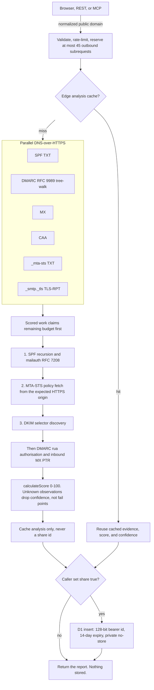

# Email Security

An Illek project.

<p align="center">
  
</p>

Serverless email security analyzer for SPF, DKIM, RFC 9989 DMARC, MX,
MTA-STS, TLS-RPT, CAA, and inbound MX reverse-DNS observations. The live
service is [email.illek.ie](https://email.illek.ie).

See [ARCHITECTURE.md](ARCHITECTURE.md) for the complete component, data-flow,
storage, security-boundary, deployment, and third-party service design.

## Contents

- [How it works](#how-it-works)
- [Features](#features)
- [Optimizations for Workers](#optimizations-for-workers)
- [Deployment](#deployment)
- [Usage](#usage)
- [API](#api)
- [Response Format](#response-format)
- [Limits](#limits)
- [Local Development](#local-development)

## How it works

A domain check gathers public DNS and policy evidence, scores only confirmed
controls, and stores a report only when the caller opts in to sharing.



Unknown DNS states (timeout, SERVFAIL, provider error, budget exhaustion) stay
distinct from confirmed absence. Determinate analyses cache for five minutes;
inconclusive or zero-score rows use a shorter window. Cache hits skip the DNS
wave but still persist a D1 row only when this request asked to share. Header
analysis is a separate stateless path: it does not query DNS, does not produce
a domain posture score, and is never saved as a shareable report.

## Features

| Feature | What it checks | Domain score |
| --- | --- | --- |
| **SPF analysis** | Mailauth RFC 7208 evaluation with lookup/void limits, plus static policy inspection | 0–25 |
| **DKIM check** | Common selector discovery | 0–25 |
| **DMARC analysis** | RFC 9989 tree-walk discovery and RFC 9990 external-report authorisation | 0–35 |
| **MX records** | Mail server enumeration | 0–8 |
| **CAA records** | Certificate authority restrictions | 0–2 |
| **Transport security** | MTA-STS policy and MX coverage checks plus TLS-RPT validation | 0–5 |
| **PTR observation** | Forward-confirmed reverse DNS for an inbound MX IP (not a sending reputation claim) | Observation only |
| **SPF inspector** | Recursive include tracing, lookup-budget analysis, and guarded flattening previews | Separate tool |
| **Record builder** | Review-ready SPF records and staged DMARC policy planning | Separate tool |
| **Header analyzer** | Stateless receiver-report interpretation, organisational-domain alignment, conflicting-result detection, structured delivery hops, and opt-in PTR enrichment | Separate tool |

Posture bands are **excellent** (≥85), **good** (≥70), **fair** (≥50), and
**poor**. Confidence is **high** when every control resolved, **medium** with
one or two unknowns, and **low** otherwise.

## Optimizations for Workers

- **Parallel DNS lookups**: All queries run concurrently
- **Edge caching**: Five-minute cache with observation times and a refresh action; upstream DNS TTLs still apply
- **Minimal CPU usage**: Efficient parsing, no regex backtracking
- **Structured DoH**: Separates NODATA, NXDOMAIN, SERVFAIL, timeout, and other errors with transient-provider fallback

## Deployment

### Prerequisites

```bash
npm install -g wrangler
wrangler login
```

### Deploy

```bash
cd email-security-checker
npm run deploy
```

`npm run deploy` resolves the current git revision and injects it as
`SOURCE_REVISION`, so `/api/health`, the API directory, and every stored report
carry truthful provenance. Extra flags pass through, so `npm run deploy -- --dry-run`
exercises the same injection without deploying. Deploying with plain
`wrangler deploy` skips the injection and reports the fallback value `unpinned`.
The release command refuses a dirty worktree because its bytes would not match
the injected commit. Use `npm run check` to dry-run uncommitted changes.

After deployment, verify the exact released commit against the canonical host:

```bash
npm run verify:release -- https://email.illek.ie <git-revision>
```

The verifier checks `/api/health`, runs the HTML and public-contract audit, and
sends the two DMARC validation requests that cover version case, permitted
whitespace, and `psd=u`. Those requests consume API rate-limit capacity, so use
`npm run audit:html` alone for a read-only production review.

### Custom Domain (Optional)

Custom domains are configured declaratively through the `routes` array in
`wrangler.toml` (`{ pattern = "your-host", custom_domain = true }`) — there is
no `wrangler custom-domain` command. The deployed routes are
`email.illek.ie` plus the legacy `checker.illek.ie` alias.

## Usage

1. Open the deployed URL
2. Enter a domain (e.g., `example.com`)
3. View comprehensive email security report

Sharing is opt-in. Tick **Create a shareable link** before checking (or send
`share: true` on the API) to mint a 14-day bearer URL. Header analysis is never
stored.

## API

Version 2 agent integration endpoints:

```text
GET  /api/v2
POST /api/v2/domain-check
POST /api/v2/header-analysis
POST /mcp
POST /mcp/v2
```

The MCP endpoints implement stateless Streamable HTTP with protocol negotiation
for `2025-11-25`, `2025-06-18`, and `2024-11-05` (an unknown requested version
negotiates down to the newest supported one, per the lifecycle spec). They
publish the complete read-only tool set through `tools/list`. Copilot Studio can
import `https://email.illek.ie/mcp-copilot.yaml`; OpenAPI agents can import
`https://email.illek.ie/openapi.yaml`. The existing API paths remain compatible.
Every `tools/call` draws from a dedicated MCP limiter at 6 requests per client per 60 seconds — tighter than the REST expensive class of 10 per minute — and from an 80-call MCP daily analysis cap (REST analysis POSTs remain 500 per UTC day). `get_email_security_report` consumes the MCP report quota (40 per UTC day) rather than the analysis quota. Bulk header analysis over MCP should batch its patience or use the REST endpoint instead.

Domain and batch reports include `source_revision`, DNS/provider observations,
`score_confidence`, and an explicit `request_budget`. DNS timeouts and provider
failures are reported as unknown observations and do not receive a definitive
failure score. Reports are stored only when `share` is true. Stored report links
are 128-bit bearer ids, expire after 14 days, can be revoked with
`DELETE /api/reports/{id}`, and are served with `Cache-Control: private, no-store`;
do not put sensitive data in header or domain inputs.

```bash
curl -X POST https://email.illek.ie/api/check \
  -H "Content-Type: application/json" \
  -d '{"domain":"example.com"}'
```

Inspect and preview SPF flattening:

```bash
curl -X POST https://email.illek.ie/api/spf/inspect \
  -H "Content-Type: application/json" \
  -d '{"domain":"example.com"}'
```

Flattened records are point-in-time previews. Dynamic, qualified, cyclic, or
unresolved mechanisms are preserved and flagged for manual review. Copying is
enabled only for the restricted positive-IP/include subset for which the tool
can preserve the original terminal result; redirects are never flattened.

Evaluate a sender using the standards engine. The client IP may be a
documentation or private address for lab fixtures; hop enrichment still
requires public addresses:

```bash
curl -X POST https://email.illek.ie/api/spf/evaluate \
  -H "Content-Type: application/json" \
  -d '{"domain":"example.com","sender":"user@example.com","helo":"mail.example.com","ip":"192.0.2.1"}'
```

Validate a proposed SPF or DMARC record:

```bash
curl -X POST https://email.illek.ie/api/records/validate \
  -H "Content-Type: application/json" \
  -d '{"type":"spf","domain":"example.com","record":"v=spf1 include:_spf.google.com ~all"}'
```

The UI keeps copy actions disabled until the validator confirms the record.

Interpret complete message headers:

```bash
curl -X POST https://email.illek.ie/api/header/analyze \
  -H "Content-Type: application/json" \
  -d '{"headers":"From: sender@example.com\r\nAuthentication-Results: mx.example; spf=pass; dkim=pass header.d=example.com; dmarc=pass"}'
```

Header analysis is stateless and capped at 256 KB. Results describe claims made
by the pasted `Authentication-Results` fields; they are not a cryptographic
re-evaluation. PTR enrichment is a separate, explicit request for up to ten
globally routable IPv4 or IPv6 addresses.

## Response Format

```json
{
  "domain": "example.com",
  "timestamp": "2026-07-22T21:00:00.000Z",
  "spf": { "status": "pass", "record": "...", "checks": [...] },
  "dkim": { "status": "warn", "selectors": [...], "checks": [...] },
  "dmarc": { "status": "pass", "policy": "reject", "checks": [...] },
  "mx": { "status": "pass", "records": [...] },
  "caa": { "status": "warn", "checks": [...] },
  "ptr": { "status": "pass", "checks": [...] },
  "score_confidence": "high",
  "unknown_controls": [],
  "source_revision": "deployment-revision",
  "request_budget": { "limit": 45, "used": 12, "remaining": 33, "exhausted": false },
  "overall_score": 85,
  "overall_status": "excellent"
}
```

## Limits

- **Workers Free**: 100,000 requests/day, 10 ms CPU time, 128 MB memory, 3 MB compressed Worker size, and 50 external subrequests per invocation
- **Worker header analysis**: zero external subrequests; local worst-case 256 KB parsing benchmark averages below 1 ms (hardware-dependent)
- **API rate limits**: REST header analysis and report reads sit behind the standard limiter at 60 requests per client per 60 seconds; other REST analysis POSTs use the expensive limiter at 10 per minute. MCP HTTP requests use a dedicated 6-per-minute limiter. Daily caps add 500 REST analysis POSTs, 80 MCP analysis tool calls, 120 REST report retrievals, and 40 MCP report retrievals per client per UTC day, with `Retry-After` counting down to the real reset. `get_email_security_report` consumes the MCP report quota, not the analysis quota. When D1 daily accounting fails, analysis POSTs fail closed with 503 instead of running uncapped. IPv6 clients share one quota bucket per /64 so rotating addresses cannot mint fresh budgets. Cloudflare Rate Limiting counters are shared across Worker isolates but scoped to the serving location, so these are not strict global quotas.
- **Request budget**: each analysis invocation reserves at most 45 outbound subrequests, leaving platform headroom below the Workers limit of 50. Batch analysis accepts at most 3 domains — each receives an equal slice of the budget and rows whose slice was exhausted carry an exhausted `request_budget` instead of a comparable score — and reports rejected items individually.
- **Stored reports**: sharing is opt-in (`share: true` or the UI checkbox). Share links are 128-bit bearer credentials with 14-day retention and can be revoked with `DELETE /api/reports/{id}`. Retrieval, export, and revoke responses are private and not cacheable. REST analysis POSTs require `Content-Type: application/json`.

## Local Development

```bash
npm install
npm test
npm run test:browser
wrangler dev
```

`npm test` is the CI gate. `npm run test:browser` (Playwright) is a release-time UI check; run it before shipping frontend changes. `scripts/verify-release.mjs` remains the post-deploy production probe (health, HTML/contract audit, two DMARC validations) and does not launch Playwright against production.

Opens at `http://localhost:8787`

## License

MIT © Koya Illek. See [LICENSE](LICENSE).

Live service: [email.illek.ie](https://email.illek.ie).
